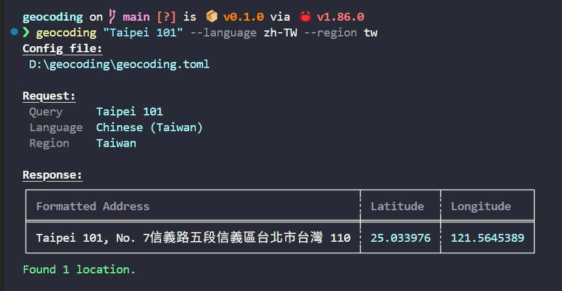

# Geocoding

[](LICENSE)

A command-line tool that converts addresses into coordinates using Google Maps.

*Powered by the amazing [google_maps](https://github.com/leontoeides/google_maps) Rust crate — a fantastic community-built library that's even better than Google's official client libraries! 🚀*



## Quick Start

1. **Get a Google Maps API key**

   See the [Google Maps Geocoding API documentation](https://developers.google.com/maps/documentation/geocoding/get-api-key).

2. **Install the tool**:
   ```bash
   cargo install --git https://github.com/Stanley5249/geocoding
   ```
   
3. **Use it**:
   ```bash
   geocoding "your-address" --api-key your-api-key
   ```

That's it! 🎉

## Examples

```bash
# Simple address lookup
geocoding "Central Park, New York"

# International addresses with language preference
geocoding "東京駅" --language ja --region jp

# Need help?
geocoding --help
```

## Setup Your API Key

### Config file (recommended)

Create `geocoding.toml` in current directory or home directory:

```toml
api_key = "your-google-maps-api-key"
language = "en"  # optional
region = "us"    # optional
```

*Priority: current directory → home directory*

### Environment variable

**Bash:**
```bash
export GOOGLE_MAPS_API_KEY=your-api-key
```

**PowerShell:**
```powershell
$env:GOOGLE_MAPS_API_KEY="your-api-key"
```

### Command line

```bash
geocoding "your-address" --api-key your-api-key
```

## License

This project is licensed under the MIT License.
